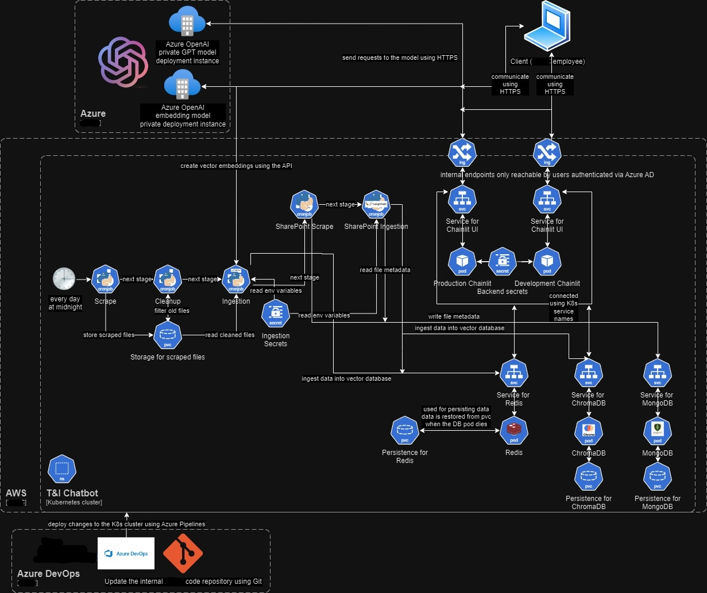

# Private GPT-based Chatbot with Azure DevOps and SharePoint Data

Welcome to the repository for the private Azure GPT instance powered chatbot, designed for internal wikis and SharePoint documents.

We've got the *Ingestion* and *Chainlit* for the backend and frontend.

## Demo
Here are demos of how the chatbot works:

<!-- Replace the GIF with a video -->
<video style="width: 100%; height: auto;" controls allowfullscreen>
  <source src="aichatdemowiki2x.mp4" type="video/mp4">
  
</video>

<!-- You can add more videos similarly -->
<video style="width: 100%; height: auto;" controls allowfullscreen>
  <source src="videodemosharepoint.mp4" type="video/mp4">
  
</video>

## Architecture Overview


## Getting Started

To set up and run this application on your local machine, ensure you have the following prerequisites:

- [Python](https://www.python.org) (version 3.11 or newer)
- An environment variables file (`.env` file) for every `.env.template`
- Docker Desktop
- API Keys from 1Password

## Running Locally
Create an `.env` file based on the structure provided in the `docker-compose.yaml` file. You can use the `.env.template` as a reference.

Then you can run the whole ingestion part with:
```sh
docker compose up --build
```
It will scrape everything from the wikis, filter and ingest to the local Redis image.
If you do not want to go through this process you can simply port forward the Redis instance from the Kubernetes cluster and use it as a local Redis instance.

In order to run the Chainlit app you need to go to the chainlit folder:
```sh
cd chainlit/src
```
Once you are there install the dependencies with from requirements.txt with:
```sh
pip install -r requirements.txt
```
Once they are installed run the app with:
```sh
chainlit run deployment_dev.py --port 9000
```

Don’t forget to replace `https://github.com/template` with the actual URL to yer GitHub repository and add an image URL to the logo you want. In chainlit config.

## Ingestion 📜
Arrr! This be where we plunder the high seas for knowledge! The Ingestion be responsible for gatherin' data from the wikis and feedin' it to private Azure GPT instance’s insatiable belly.

To read more about the ingestion, you can start by reading the [README.md](ingestion/README.md) in the ingestion folder.
Also consider reading about scraping in [azure-devops-scrape/README.md](ingestion/azure-devops-scrape/README.md) and filtering in [azure-devops-filter/README.md](ingestion/azure-devops-filter/README.md).

## Licence 📜
This project be under the GNU AFFERO GENERAL PUBLIC LICENSE License. Pillage and plunder all ye want, but remember to share the spoils!

# Azure Pipelines Chainlit Script Documentation

This script is a YAML configuration file for Azure Pipelines, a cloud service that you can use to automatically build, test, and deploy your code.

## Overview

The script is divided into several stages and jobs, each with a specific purpose. The main stages are:

1. **CI**: This stage is responsible for building and pushing the Docker image to the Amazon Elastic Container Registry (ECR).

## Detailed Breakdown

### Trigger

The pipeline is triggered when changes are pushed to the `main` branch or to the files in the `chainlit` directory or the `azure-pipelines-chainlit.yml` file itself.

### Resources

The pipeline uses the repository where the pipeline file is located (`self`).

### Variables

Several variables are defined for use throughout the pipeline, including secrets, the Docker image tag and name, and the AWS region.

### CI Stage

This stage consists of three jobs:

1. **CalculateVersion**: This job calculates the semantic version of the code using GitVersion. It also checks if a Git tag with the calculated version already exists. If not, it creates and pushes a new Git tag.

2. **Build**: This job depends on the completion of the `CalculateVersion` job. It builds a Docker image using the Dockerfile located in the `chainlit` directory and pushes the image to the ECR. It also sets the repository pull permissions and publishes the Kubernetes configuration files as a build artifact.

3. **CreateReleaseNotes**: This job depends on the `Build` job and is only executed if a new Git tag was created in the `CalculateVersion` job. It generates release notes using the `XplatGenerateReleaseNotes` task and publishes them to a wiki using the `WikiUpdaterTask`.

## Conclusion

This Azure Pipelines script provides a robust CI/CD pipeline for a Dockerized application, handling versioning, building and pushing Docker images, and generating and publishing release notes.


# Azure Pipelines Ingestion Script Documentation

This script is a YAML configuration file for Azure Pipelines, a cloud service that you can use to automatically build, test, and deploy your code.

## Overview

The script is divided into several stages and jobs, each with a specific purpose. The main stages are:

1. **CI**: This stage is responsible for building and pushing the Docker images to the Amazon Elastic Container Registry (ECR).

## Detailed Breakdown

### Trigger

The pipeline is triggered when changes are pushed to the `main` branch or to the files in the `ingestion` directory or the `azure-pipelines-ingestion.yml` file itself.

### Resources

The pipeline uses the repository where the pipeline file is located (`self`).

### Variables

Several variables are defined for use throughout the pipeline, including secrets, the Docker image tag and name, and the AWS region.

### CI Stage

This stage consists of two jobs:

1. **CalculateVersion**: This job calculates the semantic version of the code using GitVersion. It also checks if a Git tag with the calculated version already exists. If not, it creates and pushes a new Git tag.

2. **Build**: This job depends on the completion of the `CalculateVersion` job. It builds several Docker images using the Dockerfiles located in the `ingestion` directory and pushes the images to the ECR. It also sets the repository pull permissions and publishes the Kubernetes configuration files as a build artifact.

3. **CreateReleaseNotes**: This job depends on the `Build` job and is only executed if a new Git tag was created in the `CalculateVersion` job. It generates release notes using the `XplatGenerateReleaseNotes` task and publishes them to a wiki using the `WikiUpdaterTask`.

## Conclusion

This Azure Pipelines script provides a robust CI/CD pipeline for a Dockerized application, handling versioning, building and pushing Docker images, and generating and publishing release notes.


# Environment Variables Documentation

### ADO_PAT
- **Description:** Azure DevOps Personal Access Token used for authenticating API requests for scraping wikis. Ideally should belong to a service account.
- **Configuration:** Set in the environment configuration file or secrets manager.
- **Renewal:** Renew through Azure DevOps, then update the environment variable.

### AUTHORITY
- **Description:** URL of the authority server for OAuth2 authentication.
- **Configuration:** Set in the environment configuration file. Azure DevOps pipeline library for the chatbot. Set as k8s env variables.
- **Renewal:** Update the URL if the authority server changes.


### CERT_FILE_BASE64
- **Description:** Base64 encoded string of the PEM certificate file.
- **Configuration:** Set in the environment configuration file or secrets manager.
- **Renewal:** Get a new certificate in Azure for the app that has Microsoft Graph permissions to access and scrape SharePoint sites. Get the private key from the new certificate and encode it to Base64 and update the environment variable.

### CHAINLIT_AUTH_SECRET
- **Description:** Secret key used for Chainlit authentication.
- **Configuration:** Set in the environment configuration file. Azure DevOps pipeline library for the chatbot. Set as k8s env variables.
- **Renewal:** Generate a new secret and update the environment variable.

### CHROMA_COLLECTION
- **Description:** Name of the primary Chroma collection for wikis.
- **Configuration:** Set in the environment configuration file. Azure DevOps pipeline library for the chatbot. Set as k8s env variables.
- **Renewal:** Update if the collection name changes.

### CHROMA_COLLECTION_CHUNKS
- **Description:** Name of the Chroma collection for chunks of SharePoint data.
- **Configuration:** Set in the environment configuration file. Azure DevOps pipeline library for the chatbot. Set as k8s env variables.
- **Renewal:** Update if the collection name changes.

### CHROMA_COLLECTION_FULL_DOCS
- **Description:** Name of the Chroma collection for SharePoint full documents.
- **Configuration:** Set in the environment configuration file. Azure DevOps pipeline library for the chatbot. Set as k8s env variables.
- **Renewal:** Update if the collection name changes.

### CHROMA_HOST
- **Description:** Host address for the Chroma server.
- **Configuration:** Set in the environment configuration file. Azure DevOps pipeline library for the chatbot. Set as k8s env variables.
- **Renewal:** Update if the server host address changes.

### CHROMA_PORT
- **Description:** Port number for the Chroma server.
- **Configuration:** Set in the environment configuration file. Azure DevOps pipeline library for the chatbot. Set as k8s env variables.
- **Renewal:** Update if the port number changes.

### CLIENT_ID
- **Description:** Client ID for OAuth2 authentication.
- **Configuration:** Set in the environment configuration file. Azure DevOps pipeline library for the chatbot. Set as k8s env variables.
- **Renewal:** Obtain a new client ID from the OAuth provider and update the environment variable.

### MONGO_DB_NAME
- **Description:** Name of the MongoDB database.
- **Configuration:** Set in the environment configuration file. Azure DevOps pipeline library for the chatbot. Set as k8s env variables.
- **Renewal:** Update if the database name changes.

### MONGO_DOCUMENTS_COLLECTION_NAME
- **Description:** Name of the MongoDB collection for SharePoint documents.
- **Configuration:** Set in the environment configuration file. Azure DevOps pipeline library for the chatbot. Set as k8s env variables.
- **Renewal:** Update if the collection name changes.

### MONGO_HOST
- **Description:** Host address for the MongoDB server.
- **Configuration:** Set in the environment configuration file. Azure DevOps pipeline library for the chatbot. Set as k8s env variables.
- **Renewal:** Update if the server host address changes.

### MONGO_INITDB_ROOT_PASSWORD
- **Description:** Root password for MongoDB initialization.
- **Configuration:** Set in the environment configuration file. Azure DevOps pipeline library for the chatbot. Set as k8s env variables.
- **Renewal:** Change the password in MongoDB and update the environment variable.

### MONGO_INITDB_ROOT_USERNAME
- **Description:** Root username for MongoDB initialization.
- **Configuration:** Set in the environment configuration file. Azure DevOps pipeline library for the chatbot. Set as k8s env variables.
- **Renewal:** Update if the username changes.

### MONGO_PAGES_COLLECTION_NAME
- **Description:** Name of the MongoDB collection for SharePoint pages.
- **Configuration:** Set in the environment configuration file. Azure DevOps pipeline library for the chatbot. Set as k8s env variables.
- **Renewal:** Update if the collection name changes.

### MONGO_PORT
- **Description:** Port number for the MongoDB server.
- **Configuration:** Set in the environment configuration file. Azure DevOps pipeline library for the chatbot. Set as k8s env variables.
- **Renewal:** Update if the port number changes.

### OAUTH_AZURE_AD_CLIENT_ID
- **Description:** Azure AD Client ID for OAuth2 authentication.
- **Configuration:** Set in the environment configuration file. Azure DevOps pipeline library for the chatbot. Set as k8s env variables.
- **Renewal:** Obtain a new client ID from Azure and update the environment variable.

### OAUTH_AZURE_AD_CLIENT_SECRET
- **Description:** Azure AD Client Secret for OAuth2 authentication.
- **Configuration:** Set in the environment configuration file. Azure DevOps pipeline library for the chatbot. Set as k8s env variables.
- **Renewal:** Obtain a new client secret from Azure and update the environment variable.

### OAUTH_AZURE_AD_TENANT_ID
- **Description:** Azure AD Tenant ID for OAuth2 authentication.
- **Configuration:** Set in the environment configuration file. Azure DevOps pipeline library for the chatbot. Set as k8s env variables.
- **Renewal:** Update if the tenant ID changes.

### OPENAI_API_BASE
- **Description:** Base URL for Azure OpenAI API requests.
- **Configuration:** Set in the environment configuration file. Azure DevOps pipeline library for the chatbot. Set as k8s env variables.
- **Renewal:** Update if the base URL changes.

### OPENAI_API_KEY
- **Description:** API key for accessing Azure OpenAI services.
- **Configuration:** Set in the environment configuration file. Azure DevOps pipeline library for the chatbot. Set as k8s env variables.
- **Renewal:** Generate a new API key from OpenAI and update the environment variable.

### REDIS_ADDRESS
- **Description:** Address of the Redis server.
- **Configuration:** Set in the environment configuration file. Azure DevOps pipeline library for the chatbot. Set as k8s env variables.
- **Renewal:** Update if the server address changes.

### REDIS_PASSWORD
- **Description:** Password for accessing the Redis server.
- **Configuration:** Set in the environment configuration file. Azure DevOps pipeline library for the chatbot. Set as k8s env variables.
- **Renewal:** Change the password in Redis and update the environment variable.

### SCOPE
- **Description:** Scope of the OAuth2 authentication.
- **Configuration:** Set in the environment configuration file. Azure DevOps pipeline library for the chatbot. Set as k8s env variables.
- **Renewal:** Update if the scope changes.

### SERPAPI_API_KEY
- **Description:** API key for accessing SerpAPI services.
- **Configuration:** Set in the environment configuration file. Azure DevOps pipeline library for the chatbot. Set as k8s env variables.
- **Renewal:** Generate a new API key from SerpAPI and update the environment variable.

### SERPER_API_KEY
- **Description:** API key for accessing Serper services.
- **Configuration:** Set in the environment configuration file. Azure DevOps pipeline library for the chatbot. Set as k8s env variables.
- **Renewal:** Generate a new API key from Serper and update the environment variable.

### TENANT_ID
- **Description:** Tenant ID for OAuth2 authentication.
- **Configuration:** Set in the environment configuration file. Azure DevOps pipeline library for the chatbot. Set as k8s env variables.
- **Renewal:** Update if the tenant ID changes.

### THUMBPRINT
- **Description:** Thumbprint of the certificate used for authentication when scraping SharePoint.
- **Configuration:** Set in the environment configuration file. Azure DevOps pipeline library for the chatbot. Set as k8s env variables.
- **Renewal:** Update if the certificate changes.

### TRACELOOP_HEADERS
- **Description:** Headers for Traceloop tracing. Used for tracing requests and responses in the application and sending them to Grafana Cloud.
- **Configuration:** Set in the environment configuration file. Azure DevOps pipeline library for the chatbot. Set as k8s env variables.
- **Renewal:** Update if the Grafana Cloud endpoint or API key change.

Each variable should be configured in the environment configuration file or a secure secrets manager depending on its sensitivity. Renewals typically involve generating new keys, tokens, or updating configuration details in the respective services, and then updating the environment variables accordingly.